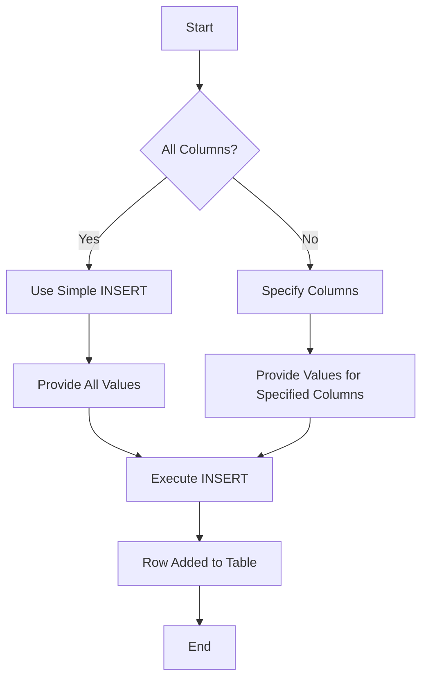

```markdown
# SQL Server: Data Manipulation Language (DML)

## Table of Contents
1. [Introduction](#introduction)
2. [INSERT Operation](#insert-operation)
   - [Simple Insert (Single Row)](#simple-insert-single-row)
   - [Multiple-row Insert](#multiple-row-insert)
3. [Best Practices](#best-practices)
4. [Visualizing the INSERT Process](#visualizing-the-insert-process)
5. [Conclusion](#conclusion)

## Introduction

Data Manipulation Language (DML) is a subset of SQL that focuses on manipulating data within database tables. The primary DML operations are INSERT, UPDATE, and DELETE. This document focuses on the INSERT operation.

## INSERT Operation

The INSERT operation is used to add new records to a table. There are two main forms of INSERT:

1. Simple Insert (Single Row)
2. Multiple-row Insert

### Simple Insert (Single Row)

This form of INSERT adds just one row of data to the table.

#### Example 1: Inserting values for all columns

```sql
INSERT INTO Employees 
VALUES('Ahmed', 'Nasr', '02-09-2010', 'Alex', 'M', '5000', NULL, NULL)
```

In this example:
- Values are provided for all columns except the ID (which is auto-incremented).
- The order of values must match the order of columns in the table.
- NULL is used for SupervisorID and DepartmentNumber.

#### Example 2: Inserting values for specific columns

```sql
INSERT INTO Employees (fName, BDate, Sex, Salary)
VALUES ('Mohamed', '10-11-1996', 'M', '9000')
```

In this case:
- Only specified columns receive values.
- Unspecified columns must either:
  1. Have an identity constraint (e.g., Id)
  2. Have a default value (e.g., Address)
  3. Allow NULL (e.g., LName, SuperId, DepartmentNumber)

### Multiple-row Insert

SQL Server allows inserting multiple rows in a single INSERT statement. This is often more efficient than multiple single-row inserts.

```sql
INSERT INTO Employees (FirstName, LastName, BirthDate, Address, Sex, Salary, SupervisorID, DepartmentNumber)
VALUES 
  ('Ahmed', 'Nasr', '02-09-2010', 'Alex', 'M', '5000', NULL, NULL),
  ('Sara', 'Ali', '15-03-1995', 'Cairo', 'F', '6000', NULL, NULL)
```

## Best Practices

1. Specify column names explicitly to avoid errors if table structure changes.
2. Use NULL for unknown or inapplicable values.
3. Ensure data types match between the values and the table columns.
4. Use multiple-row INSERT when adding several records for better performance.
5. Always test INSERT statements on a development database before running them on production.

## Visualizing the INSERT Process



This diagram illustrates the decision process when using the INSERT statement.

## Conclusion

The INSERT statement is a fundamental DML operation for adding data to SQL Server tables. Understanding its variations and best practices is crucial for effective database management. Whether you're inserting a single row or multiple rows, always ensure data integrity and follow the table's constraints.

Remember to verify the inserted data after execution:
- Use `SELECT` statements to check the newly inserted records.
- Check the number of affected rows in the execution results.

As you become more comfortable with INSERT operations, you'll be able to efficiently manage data in your SQL Server databases.
```

This Markdown file provides a comprehensive overview of the INSERT operation in SQL Server's DML. It includes examples, best practices, a visual representation of the process, and additional context. You can easily add this to your GitHub repository as a single file.

Would you like me to make any changes or additions to this content?
