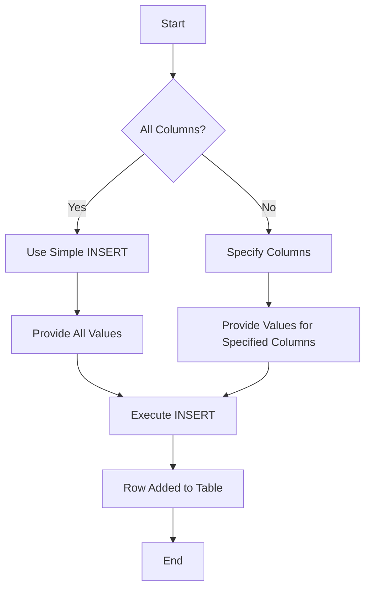
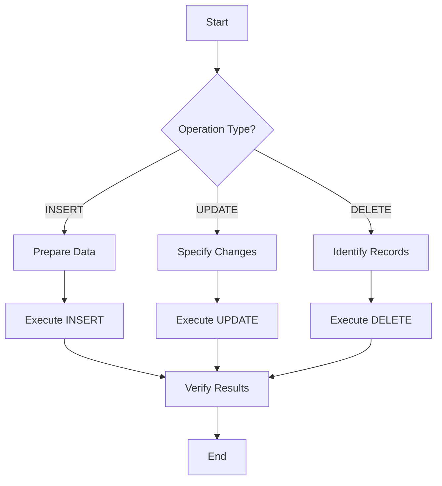

# SQL Server: Data Manipulation Language (DML)

## Table of Contents
1. [Introduction](#introduction)
2. [INSERT Operation](#insert-operation)
   - [Simple Insert (Single Row)](#simple-insert-single-row)
   - [Multiple-row Insert](#multiple-row-insert)
3. [Best Practices](#best-practices)
4. [Visualizing the INSERT Process](#visualizing-the-insert-process)
5. [Conclusion](#conclusion)

## Introduction

Data Manipulation Language (DML) is a subset of SQL that focuses on manipulating data within database tables. The primary DML operations are INSERT, UPDATE, and DELETE. This document focuses on the INSERT operation.

## INSERT Operation

The INSERT operation is used to add new records to a table. There are two main forms of INSERT:

1. Simple Insert (Single Row)
2. Multiple-row Insert

### Simple Insert (Single Row)

This form of INSERT adds just one row of data to the table.

#### Example 1: Inserting values for all columns

```sql
INSERT INTO Employees 
VALUES('Ahmed', 'Nasr', '02-09-2010', 'Alex', 'M', '5000', NULL, NULL)
```

In this example:
- Values are provided for all columns except the ID (which is auto-incremented).
- The order of values must match the order of columns in the table.
- NULL is used for SupervisorID and DepartmentNumber.

#### Example 2: Inserting values for specific columns

```sql
INSERT INTO Employees (fName, BDate, Sex, Salary)
VALUES ('Mohamed', '10-11-1996', 'M', '9000')
```

In this case:
- Only specified columns receive values.
- Unspecified columns must either:
  1. Have an identity constraint (e.g., Id)
  2. Have a default value (e.g., Address)
  3. Allow NULL (e.g., LName, SuperId, DepartmentNumber)

### Multiple-row Insert

SQL Server allows inserting multiple rows in a single INSERT statement. This is often more efficient than multiple single-row inserts.

```sql
INSERT INTO Employees (FirstName, LastName, BirthDate, Address, Sex, Salary, SupervisorID, DepartmentNumber)
VALUES 
  ('Ahmed', 'Nasr', '02-09-2010', 'Alex', 'M', '5000', NULL, NULL),
  ('Sara', 'Ali', '15-03-1995', 'Cairo', 'F', '6000', NULL, NULL)
```

## Best Practices

1. Specify column names explicitly to avoid errors if table structure changes.
2. Use NULL for unknown or inapplicable values.
3. Ensure data types match between the values and the table columns.
4. Use multiple-row INSERT when adding several records for better performance.
5. Always test INSERT statements on a development database before running them on production.

## Visualizing the INSERT Process



This diagram illustrates the decision process when using the INSERT statement.

## Conclusion

The INSERT statement is a fundamental DML operation for adding data to SQL Server tables. Understanding its variations and best practices is crucial for effective database management. Whether you're inserting a single row or multiple rows, always ensure data integrity and follow the table's constraints.

Remember to verify the inserted data after execution:
- Use `SELECT` statements to check the newly inserted records.
- Check the number of affected rows in the execution results.

As you become more comfortable with INSERT operations, you'll be able to efficiently manage data in your SQL Server databases.


# SQL Server: Data Manipulation Language (DML) 

## Multiple-Row INSERT

Adding multiple records at once is efficient using the row constructor method:

```sql
INSERT INTO Employees 
VALUES 
('Mai', 'Mohamed', '02-09-2010', 'Giza', 'F', 5000, 1, NULL),
('Ahmed', 'Ali', '02-09-2010', 'Tanta', 'M', 1000, 2, NULL),
('Omar', 'Ali', '02-09-2010', 'Cairo', 'M', 3000, 1, NULL),
('Mona', 'Mohamed', '02-09-2010', 'Giza', 'F', 2000, 1, NULL)
```

This inserts four employee records in one statement.

## UPDATE Operations

### Update a Single Column
```sql
UPDATE Employees
SET EmpAddress = 'Giza'
WHERE Id = 1
```

### Update Multiple Columns
```sql
UPDATE Employees 
SET FName = 'Hamada', LName = 'Lalo'
WHERE id = 2
```

### Conditional Update
```sql
UPDATE Employees 
SET Salary += Salary * 0.1 
WHERE Address = 'Cairo' AND Salary < 5000
```

This increases salary by 10% for employees in Cairo with salary less than 5000.

## DELETE Operation

Remove a specific record:

```sql
DELETE FROM Employees 
WHERE Id = 6
```

**Note:** Deleted IDs are not reused for new insertions to maintain data integrity and allow potential recovery.

## Additional Notes

- You can add records using the table wizard in SQL Server Management Studio.
- New records will use the next available ID, skipping deleted IDs.
- You can update or delete records directly in the table view by right-clicking.

Remember to always use WHERE clauses in UPDATE and DELETE operations to avoid unintended changes to your data.


## Visualizing DML Operations



This diagram illustrates the general process for DML operations in SQL Server.


# SQL Data Query Language (DQL): SELECT Basics

## Table of Contents
1. [Introduction to DQL](#introduction-to-dql)
2. [Basic SELECT Statement](#basic-select-statement)
3. [Selecting Specific Columns](#selecting-specific-columns)
4. [Concatenating Columns](#concatenating-columns)
5. [Using Aliases](#using-aliases)
6. [Advanced SELECT Features](#advanced-select-features)

## Introduction to DQL

Data Query Language (DQL) is a part of SQL focused on retrieving data from the database. The primary command in DQL is SELECT, which is used to query and display data without affecting the database content.

## Basic SELECT Statement

The most basic form of the SELECT statement retrieves all columns from a table:

```sql
SELECT *
FROM TableName
```

Example:
```sql
SELECT *
FROM Student
```

This query displays all columns and rows from the Student table.

## Selecting Specific Columns

To retrieve only certain columns:

```sql
SELECT St_Fname, St_LName
FROM Student
```

This query displays only the first name and last name columns from the Student table.

## Concatenating Columns

You can combine multiple columns in the SELECT statement:

```sql
SELECT St_FName + ' ' + St_LName
FROM Student
```

This query concatenates the first name and last name with a space in between.

## Using Aliases

Aliases allow you to rename columns or expressions in the query results.

### Using AS Keyword

```sql
SELECT St_FName + ' ' + St_LName AS FullName
FROM Student
```

### Without AS Keyword

```sql
SELECT St_FName + ' ' + St_LName FullName
FROM Student
```

### Multi-Word Aliases

For aliases with multiple words, use square brackets:

```sql
SELECT St_FName + ' ' + St_LName [Full Name]
FROM Student
```

### Alternative Alias Syntax

```sql
SELECT [Full Name] = St_FName + ' ' + St_LName 
FROM Student
```

## Advanced SELECT Features

The SELECT statement can be used with various other SQL features:

- Aggregate functions
- Grouping
- Unions
- Joins
- Subqueries

These advanced features allow for more complex data retrieval and analysis.

## Conclusion

The SELECT statement is a powerful tool in SQL for retrieving and displaying data. By mastering its basic syntax and features, you can effectively query databases to extract the information you need.


# SQL WHERE Clause Examples

The WHERE clause in SQL is used to filter records based on specific conditions. Here are various examples:

## Equality Comparison

Select a student with a specific ID:

```sql
SELECT St_Id, St_FName, St_Age, St_Address
FROM Student
WHERE St_Id = 1
```

## Greater Than Comparison

Get students older than 22:

```sql
SELECT St_Id, St_FName, St_Age, St_Address
FROM Student 
WHERE St_Age > 22
```

## Range Comparison

Using AND:
```sql
SELECT St_Id, St_FName, St_Age, St_Address
FROM Student 
WHERE St_Age >= 22 AND St_Age <= 29
```

Using BETWEEN:
```sql
SELECT St_Id, St_FName, St_Age, St_Address
FROM Student 
WHERE St_Age BETWEEN 22 AND 29
```

## Multiple Conditions with OR

Get students from specific cities:

```sql
SELECT St_Id, St_FName, St_Age, St_Address
FROM Student 
WHERE St_Address = 'Cairo' OR St_Address = 'Alex' OR St_Address = 'Mansoura'
```

## Using IN Clause

A more concise way to check multiple possible values:

```sql
SELECT St_Id, St_FName, St_Age, St_Address
FROM Student 
WHERE St_Address IN ('Cairo', 'Alex', 'Mansoura')
```

## Using NOT IN Clause

Exclude specific values:

```sql
SELECT St_Id, St_FName, St_Age, St_Address
FROM Student 
WHERE St_Address NOT IN ('Cairo', 'Alex', 'Mansoura')
```

These examples demonstrate various ways to use the WHERE clause to filter data in SQL queries.
